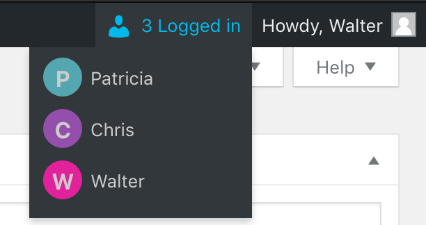

# Login Monitor 

  

## Description
Displays current logged in users in administration screens in real time.

## Installation 

1. Upload the plugin package to the plugins directory.
2. Activate the plugin through the 'Plugins' menu in WordPress.

## Screenshots

